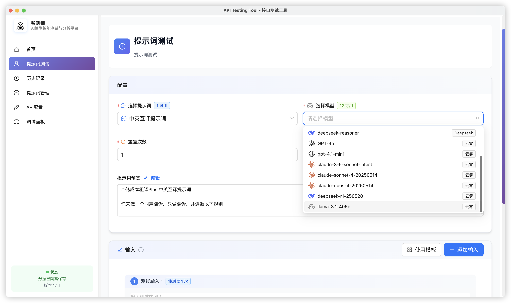

# Test Master AI - 专业AI提示词测试工具

一款专注于验证不同提示词对大语言模型输出结果差异的专业工具，帮助用户优化提示词工程，提高AI应用的稳定性和效果。



## 🎯 产品定位
通过批量测试和对比分析，让用户直观了解不同提示词在相同输入下的输出差异，快速筛选出最佳提示词方案。


## 🌟 核心功能

### 🔑 API配置管理
- 支持OpenAI兼容接口配置
- 支持直接URL模式和标准API模式
- API Key安全存储，界面默认隐藏
- 多模型管理和连接测试

### 📝 提示词管理
- 提示词的增删改查操作
- 提示词内容编辑和预览
- 支持提示词分类管理

### 🧪 智能测试引擎
- 批量测试多个提示词
- 可配置重复次数和请求间隔
- 实时测试进度显示
- 支持测试过程中停止操作

### 📊 结果分析
- 直观的测试结果对比展示
- 详细的测试统计信息
- 支持导出Excel/CSV格式
- 复制结果到剪贴板功能

### 📚 测试历史
- 完整的测试会话记录
- 历史详情查看和管理
- 本地数据持久化存储

### 🌍 国际化
- 中英文双语界面
- 自动语言检测
- 用户语言偏好保存

## 🚀 快速开始

### 环境要求
- Node.js 16+
- npm 或 yarn

### 开发环境
```bash
# 克隆项目
git clone https://github.com/your-repo/test-master-ai.git
cd test-master-ai

# 安装依赖
npm install

# 启动开发服务
npm run dev
```

### 构建应用
```bash
# 构建前端
npm run build

# 打包桌面应用
npm run dist
```

## 📖 使用指南

1. **配置API**：在"API配置"页面添加你的API Key和Base URL
2. **获取模型**：点击"获取模型"验证连接并拉取可用模型
3. **创建提示词**：在"提示词管理"页面添加和编辑提示词模板
4. **执行测试**：选择提示词、模型，设置测试参数，开始测试
5. **查看结果**：实时监控测试进度，查看结果对比和统计
6. **导出数据**：将测试结果导出为Excel/CSV或复制到剪贴板

## 🛠️ 技术栈

- **前端框架**:React 18+TypeScript
- **U| 组件**: Ant Design 5 + Tailwind CSS
- **桌面应用**:Electron 25
- **构建工具**:Vite 5
- **数据持久化**:
  - **全平台主力**:SQLite(sql.js，Electron 下支持 better-sqlite3)，所有业务数据均存储于 SQLite
  - **数据快照备份**:IndexedDB(用于 SQLite 数据的持久化快照，提升数据安全性
  - **配置/偏好**:electron-store(仅桌面端，极少量设置).
  - **localStorage**:仅用于历史数据迁移和兼容，**不再作为主数据存储****
- 智能存储适配**:StorageAdapter 自动切换最优方案，支持数据迁移与降级
- **国际化**:i18next+react-i18next
- **数据处理**:xlsX
- **自动化测试**:Playwright、Puppeteer
- **Markdown 渲染**:react-markdown+remark-gfm(支持可视化/原文切换、代码高亮、表格等)
- **Cl/CD**: GitHub Actions + electron-builder

## 📁 项目结构

```
test-master-ai/
├── src/                    # 前端源码
│   ├── components/         # React组件
│   ├── hooks/              # 自定义Hooks
│   ├── utils/              # 工具函数
│   ├── types/              # 类型定义
│   ├── i18n/               # 国际化文件
│   └── constants/          # 常量定义
├── electron/               # Electron主进程
├── public/                 # 静态资源
├── release/                # 打包输出
└── docs/                   # 项目文档
```

## 🚀 版本发布流程

1. **更新版本号**
   ```bash
   npm version patch   # 修订号 +0.0.1
   npm version minor   # 次版本 +0.1.0
   npm version major   # 主版本 +1.0.0
   ```
2. **同步文档版本号**
   - `README.md`、`RELEASE-NOTES.md`、`PROJECT_OVERVIEW.md`、`package.json` 保持一致。
3. **编写发布说明**
   - 在 `RELEASE-NOTES.md` 顶部添加新版本条目。
4. **推送代码与标签**
   ```bash
   git add .
   git commit -m "chore: 发布 vX.X.X"
   npm run release:tag
   ```
5. **自动发布**
   - 推送带 `vX.X.X` 语义化 tag 后，GitHub Actions 会自动构建并发布正式版安装包。
6. **详细操作与规范**
   - 详见 [`VERSION-UPDATE-GUIDE.md`](./VERSION-UPDATE-GUIDE.md)

## 🔒 安全特性

- API Key本地加密存储
- 敏感信息界面默认隐藏
- 用户数据完全本地化
- 多用户数据隔离

## 📈 性能特点

- 首屏加载时间 < 1秒
- 测试响应延迟 < 200ms
- 导出处理速度 1000条/秒
- 历史查询时间 < 120ms

## 🎯 适用场景

- **提示词工程师**：优化和测试提示词效果
- **AI应用开发者**：验证AI集成的稳定性
- **产品经理**：评估AI功能的用户体验
- **研究人员**：分析AI模型的输出一致性

## 📦 下载安装

前往 [Releases](https://github.com/your-repo/test-master-ai/releases) 页面下载适合你系统的安装包。

## 📝 版本信息

- **当前版本**: v1.0.11
- **发布时间**: 2025年6月5日

详细更新日志请查看 [RELEASE-NOTES.md](RELEASE-NOTES.md)

## 📄 许可证

本项目采用 [GPL-3.0](LICENSE) 开源许可证。

## 🤝 贡献指南

1. Fork 本仓库
2. 创建功能分支 (`git checkout -b feature/AmazingFeature`)
3. 提交更改 (`git commit -m 'Add some AmazingFeature'`)
4. 推送到分支 (`git push origin feature/AmazingFeature`)
5. 发起 Pull Request

## 📞 支持与反馈

- **GitHub Issues**: 报告问题和功能建议
- **项目主页**: 查看最新动态和文档

---

🎉 **Test Master AI v1.0.0** - 让AI提示词测试变得简单高效！
